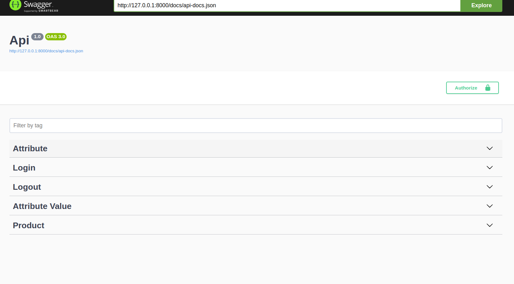
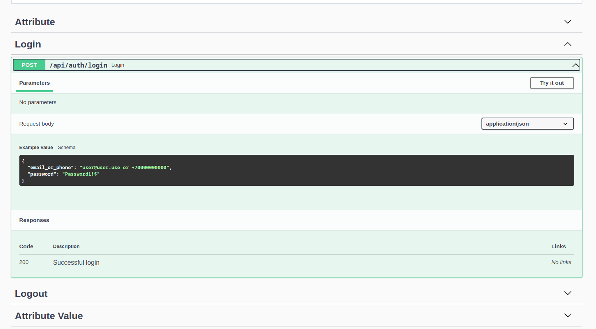
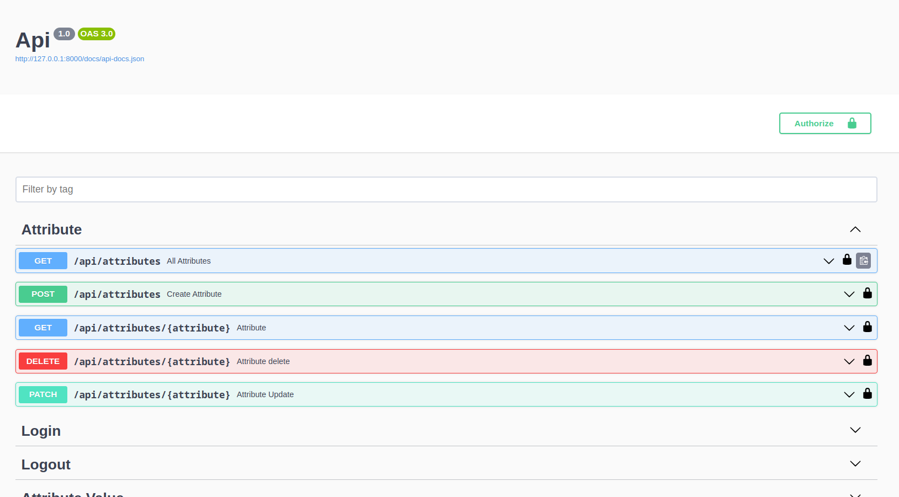

# App_api

# Demo http://37.140.198.7/api/documentation# 

### API backend на фреймворке Laravel. БД mysql. 

### Регистрация: ФИО, email (уникальный), телефон (уникальный), пароль, подтверждение пароля. Все поля обязательны. Пароль не менее 6 символов, только латиница, минимум 1 символ верхнего регистра, минимум 1 символ нижнего регистра, минимум 1 спец символ $%&!:. Телефон удовлетворяет маске: +7 после чего идет 10 цифр.

### Авторизация: email или телефон (одно поле), пароль. 

### Методы доступные неавторизованным пользователям: регистрация, авторизация.

### Для атворизованных пользователей доступен “каталог товаров”, "Опции товара". Можно создавать товары (CRUD), при создании товара создаются автоматом опции (цвет1, цвет2, бренд). Опции редактируемые, можно менять цвет1, цвет2. бренд и принадлежность к товару "product_id".

### Фильтр продуктов по трем свойсвам.

### Register 

### Swagger 

### Login

### Products

### Product Filter

### Properties

